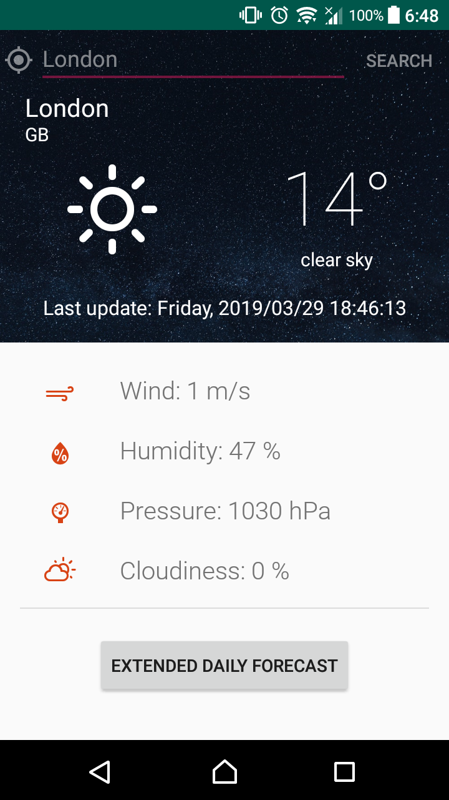
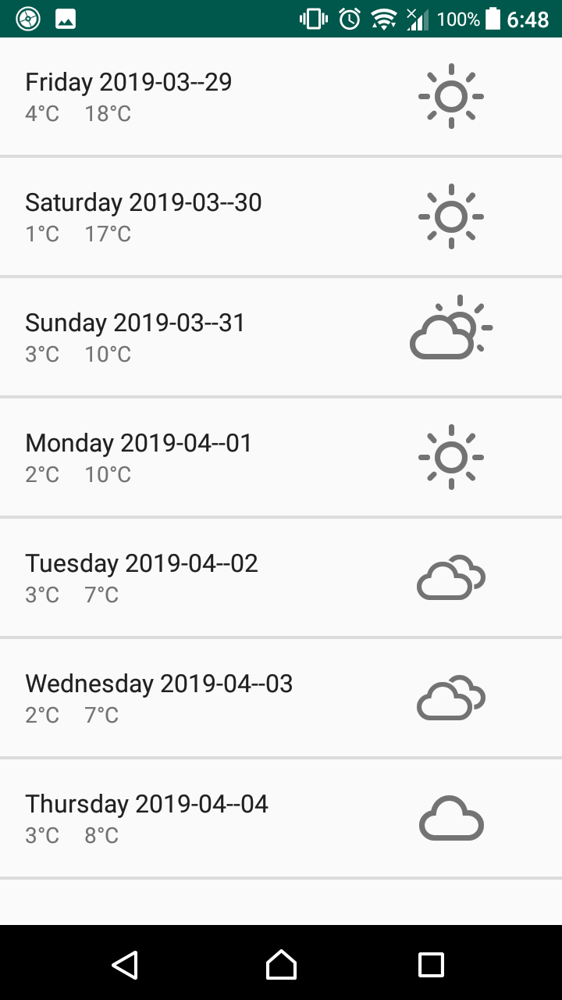
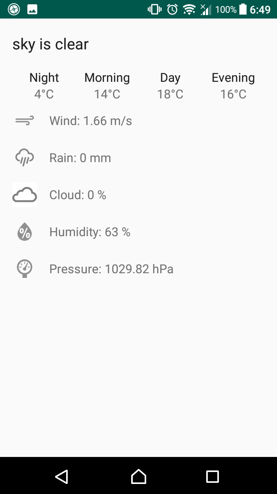

# WeatherForecast
## Getting started
A simple weather forecast Android app using API from: https://openweathermap.org/
## API Reference
This project uses 2 API from: https://openweathermap.org/

Sign in and get *API keys* for free API **Current weather data**

With **16 day/ daily forecast** API, it is only available for all paid accounts.
## Layout

